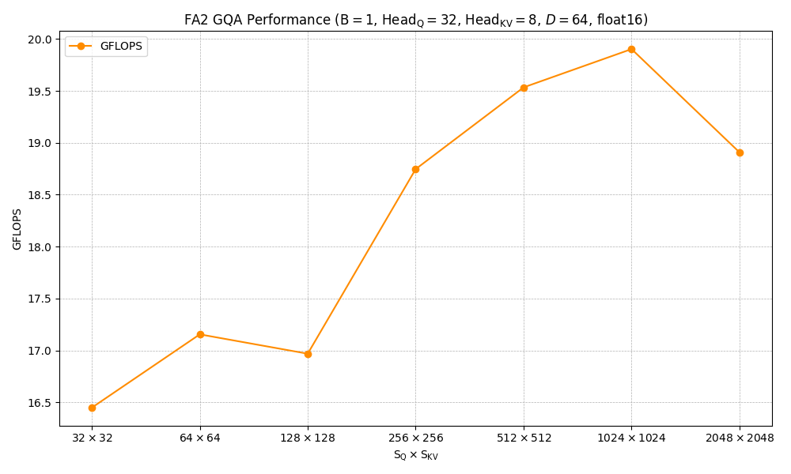
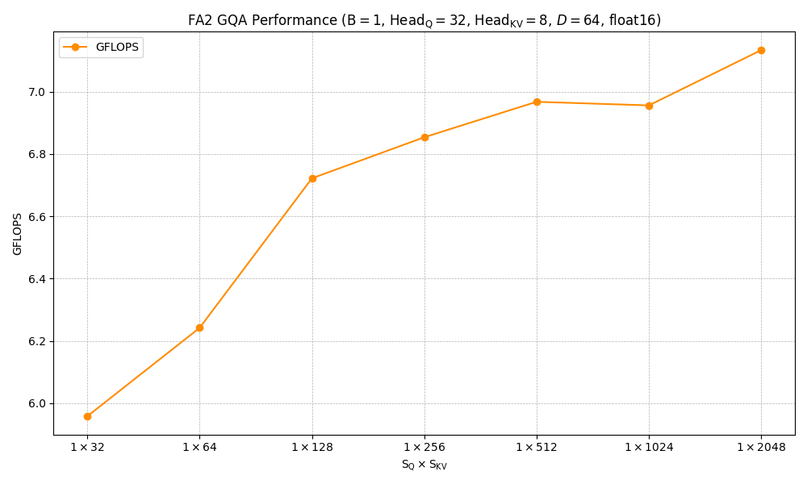
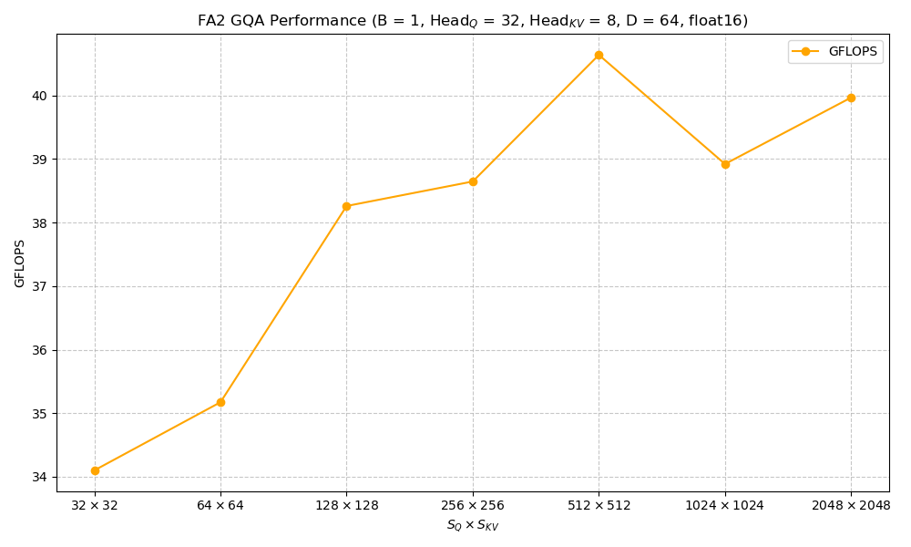
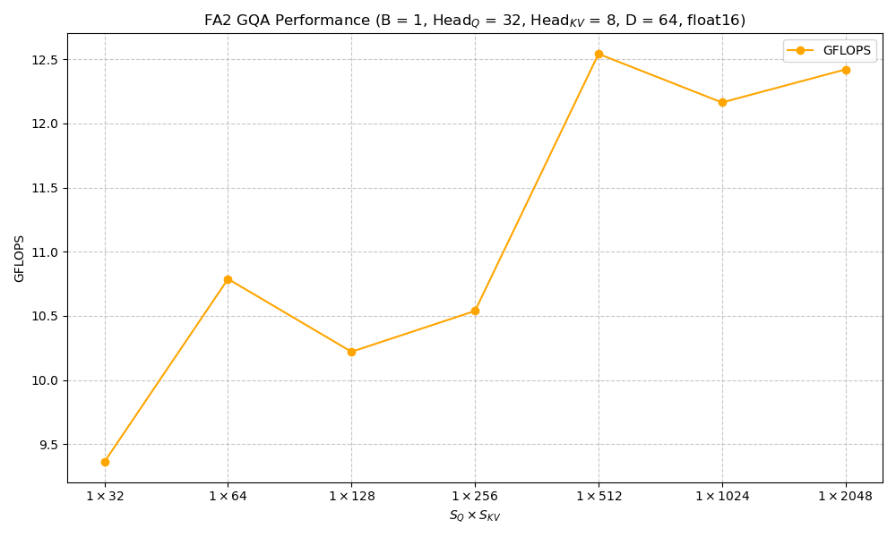

# MobiAttn

Mobile Attention(MobiAttn) is a head-only library designed for transformer-based models. Currently in its early stages, the library aims to explore the application and performance of various attention algorithms on mobile devices.

## Key Features

1. [FlashAttention](https://arxiv.org/abs/2307.08691)
    - Causal Mask
    - ​​Multi-Head & Grouped-Query Attention​​
    - Arm Neon SIMD optimizations with OpenMP parallelization for mobile CPUs

## Benchmark Summary

### Arm Neon Flash Attention 2

The v-250508 benchmark is run on 8gen1+ device with 4 threads.

<div style="display: flex;">
    <div style="flex: 1;">
        
    </div>
    <div style="flex: 1;">
        
    </div>
</div>

The v-20250627 benchmark is run on 8elite device with 6 threads.

<div style="display: flex;">
    <div style="flex: 1;">
        
    </div>
    <div style="flex: 1;">
        
    </div>
</div>

## How to use?

MobiAttn is a header-only library. Using MobiAttn is straightforward - we provide a simple build script to help you compile examples, test cases, and benchmark applications.

```shell
git clone https://github.com/chenghuaWang/MobiAttn
```

First, update the `cmake_toolchain_file` option in `tasks/android_build_armv8.yaml` to point to your NDK path. Then execute:

```shell
python build.py tasks/android_build_armv8.yaml
```

### Integration as CMake Sub-project

To integrate with other CMake projects:

```cmake
add_subdirectory(MobiAttn)
add_executable(foo main.cpp)
target_link_libraries(foo PRIVATE mafa2)
```

## Roadmap

- Implement Sparse Attention support for Multi-Modality LLMs
